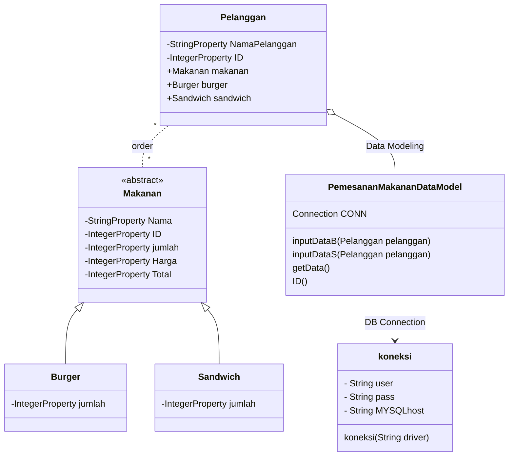

# Final-Project
### Nama Anggota :
1. Mita Anggraeni - 1917051040
2. Della Hayu Enggarini - 1917051056
3. Fista Dwi Septiana - 1917051066


### Pembagian Tugas
1. Menyusun README.md (Diskusi melalui Google Meet : Mita, Della, Fista)
2. Membuat Design Database di php myadmin (Mita)
3. Membuat Class Diagram di mermaid live editor (Fista)
4. Membuat ER Diagram di mermaid live editor (Della)
5. Membuat kode program di netbeans (Diskusi melalui Google Meet : Mita, Della, Fista)
6. Membuat kode program db helper di netbeans (Diskusi melalui Google Meet : Mita, Della, Fista)
7. Membuat desain GUI di scene builder (Diskusi melalui Google Meet : Mita, Della, Fista)


# Sistem Informasi Pemesanan Makanan
'SI Pemesanan Makanan' merupakan Sistem Informasi yang dapat digunakan untuk menginput data Pemesanan Makanan yang dikhususkan untuk Booth Penjualan Burger dan Sandwich.

# Desain
Untuk melihat diagram di bawah ini, instal plugin mermaid-diagram di https://github.com/Redisrupt/mermaid-diagrams

### Class Diagram
```mermaid
classDiagram
    Makanan <|-- Burger
    Makanan <|-- Sandwich
    Pelanggan -- Makanan
    

    class Makanan{
    <<abstract>>
        +Makanan(int ID,int Jumlah)
        -String Nama
        -int ID
        -int jumlah
        -int Harga
        -int Total
        +TotalH()*
        +getHarga() int
        +getNama() String
        +getTotal() int
        +getJumlah() int
        +setNama()
        +setHarga()
        +setJumlah()
        +getID() int
    }
    
    class Pelanggan{
        -int ID
        -String NamaPelanggan
        +Makanan makanan
        +Burger burger
        Sandwich sandwich
        +setNama(String nama)
        +SetID (int id) 
        +getID() int
        +getnama() String
        +getMakananID() int
    }

    class Burger{
        -int Jumlah
        +TotalH()
    }

    class Sandwich{
        -int Jumlah
        +TotalH()
    }
 ```   


### ER Diagram
```mermaid
erDiagram
    Pelanggan ||..|| Makanan : order
    Makanan ||--|| Burger : is
    Makanan || -- || Sandwich : is

    Makanan{
        String Nama
        int ID
        int jumlah
        int Harga
        int Total
    }
    Burger{
        int jumlah
    }
    Sandwich{
        int jumlah
    }
    Pelanggan{
        int ID
        String NamaPelanggan
    }
```

### Design Class Diagram for JavaFX and Database

