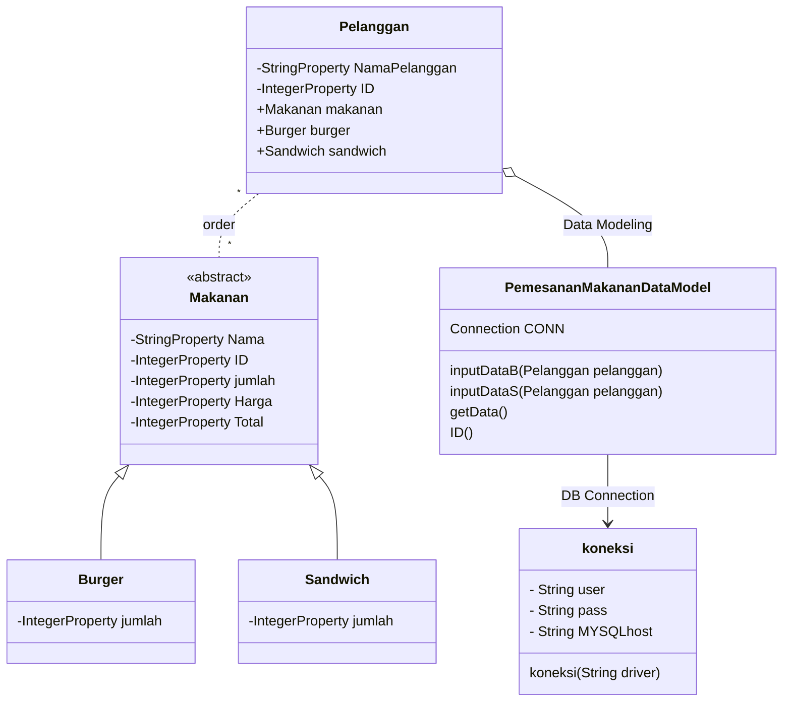

# Final-Project
### Nama Anggota :
1. Mita Anggraeni - 1917051040
2. Della Hayu Enggarini - 1917051056
3. Fista Dwi Septiana - 1917051066


### Pembagian Tugas
1. Menyusun README.md (Diskusi melalui Google Meet : Mita, Della, Fista)
2. Membuat Design Database di php myadmin (Mita)
3. Membuat Class Diagram di mermaid live editor (Fista)
4. Membuat ER Diagram di mermaid live editor (Della)
5. Membuat kode program di netbeans (Diskusi melalui Google Meet : Mita, Della, Fista)
6. Membuat desain GUI di scene builder (Diskusi melalui Google Meet : Mita, Della, Fista)


# Sistem Informasi Pemesanan Makanan
'SI Pemesanan Makanan' merupakan Sistem Informasi yang dapat digunakan untuk menginput data Pemesanan Makanan yang dikhususkan untuk Booth Penjualan Burger dan Sandwich.
Jadi, pertama user akan memasukkan nama. Selanjutnya user akan memilih jenis makanan yang akan dibeli yaitu burger atau sandwich. Berikutnya user akan memasukkan jumlah makanan yang akan dibeli. Setelah itu klik "Input". Dan data pembelian user tersimpan ke database. Untuk ID user atau pelanggan akan terisi otomatis, dimana ID nya akan melanjutkan ID pelanggan sebelumnya. Dan akan tampil pula total harga pembelian makanan.

# Desain
Untuk melihat diagram di bawah ini, instal plugin mermaid-diagram di https://github.com/Redisrupt/mermaid-diagrams

### Class Diagram
Class Diagram dalam Unified Modeling Language (UML) adalah jenis diagram struktur statis yang mendeskripsikan struktur statis yang mendeskripsikan struktur sistem dengan menunjukkan class sistem, atribut, operasi (atau method), dan hubungan antar objek (relasi).

Pada Class Diagram Sistem Pemesanan Makanan, terdapat 4 class yaitu : Pelanggan, Makanan, Burger, dan Sandwich.
- Di dalam class Pelanggan terdapat beberapa atribut ID, NamaPelanggan, Makanan (merupakan atribut dari class Makanan), Burger (aribut dari class Burger), dan Sandwich (atribut dari class Sandwich). Di dalamnya juga terdapat beberapa method yaitu setNama, setID, getID, getNama, getMakanan.
- Class Makanan. Class Makanan merupakan sebuah class abstract dan juga Superclass dari class Burger dan Sandwich. Di dalam class Makanan terdapat beberapa atribut, diantaranya : Nama, ID, Jumlah, Harga, dan Total. Dan juga terdapat beberapa method yaitu : Constructor Makanan, TotalH, getHarga, getNama, getTotal, getJumlah, setNama, setHarga, setJumlah, dan getID.
- Class Burger dan Class Sandwich. Class Burger dan class Sandwich merupakan subclass dari class Makanan. Di dalamnya terdapat atribut Jumlah dan method TotalH.

Untuk menentukan visibilitas anggota class (atribut dan method), notasi yang ditempatkan sebelum nama anggota yaitu :
Public (+), Private (-), Protected (#).

Setiap class berelasi dengan class lain, diantaranya :
- Class Pelanggan dengan Class Makanan (--) : Link (Solid). Di desain diagram juga relasi ini bisa disebut relasi Asosiasi, yang merupakan relasi antar class dengan makna umum.
- Class Burger ke class Makanan (<|--) : Inheritance, yang merupakan relasi untuk class pewarisan atau relasi dari subclass ke superclass.
- Class Sandwich ke class Makanan (<|--) :  Inheritance, yang merupakan relasi untuk class pewarisan atau relasi dari subclass ke superclass.


```mermaid
classDiagram
    Makanan <|-- Burger
    Makanan <|-- Sandwich
    Pelanggan -- Makanan
    

    class Makanan{
    <<abstract>>
        +Makanan(int ID,int Jumlah)
        -String Nama
        -int ID
        -int jumlah
        -int Harga
        -int Total
        +TotalH()*
        +getHarga() int
        +getNama() String
        +getTotal() int
        +getJumlah() int
        +setNama()
        +setHarga()
        +setJumlah()
        +getID() int
    }
    
    class Pelanggan{
        -int ID
        -String NamaPelanggan
        +Makanan makanan
        +Burger burger
        +Sandwich sandwich
        +setNama(String nama)
        +setID (int id) 
        +getID() int
        +getnama() String
        +getMakananID() int
    }

    class Burger{
        -int Jumlah
        +TotalH()
    }

    class Sandwich{
        -int Jumlah
        +TotalH()
    }
 ```   


### ER Diagram
Entity Relationship Diagram adalah diagram yang menggambarkan hal-hal yang saling terkait dalam domain tertentu. ER Diagram terdiri dari entitas dan menentukan hubungan antar entitas.

ER Diagram dari Sistem Pemesanan Makanan terdiri dari 4 entitas yaitu entitas Pelanggan, Makanan, Burger, dan Sandwich. Masing-masing entitas tersebut saling berhubungan. Seorang pelanggan dapat order makanan. Makanan yang dapat diorder ada 2 jenis, yaitu Burger dan Sandwich. Jadi seorang pelanggan dapat membeli Burger ataupun Sandwich.


```mermaid
erDiagram
    Pelanggan ||..|| Makanan : order
    Makanan ||--|| Burger : is
    Makanan || -- || Sandwich : is

    Makanan{
        String Nama
        int ID
        int jumlah
        int Harga
        int Total
    }
    Burger{
        int jumlah
    }
    Sandwich{
        int jumlah
    }
    Pelanggan{
        int ID
        String NamaPelanggan
    }
```

### Design Class Diagram for JavaFX and Database
Design Class Diagram untuk JavaFX dan Database, terdapat 6 class yaitu Class Pelanggan, Makanan, Burger, Sandwich, PemesananMakananDataModel, dan koneksi. 
Tipe data dari masing-masing class menggunakan StringProperty untuk tipe data String, IntegerProperty untuk yang bertipe integer, dll. Tipe data atau class ini merupakan class yang observable yang digunakan ketika membaca form di JavaFX. Terutama jika menggunakan tabel, maka harus menggunakan class yang sifatnya observable. 

Class PemesananMakananDataModel digunakan untuk berinteraksi dengan databasenya, apakah akan menambah data, mengambil data dari database. Class PemesananMakananDataModel melakukan koneksi dengan bantuan class koneksi.
Relasi antar class :
- Class Burger ke Makanan (<|--) : Inheritance, yang merupakan relasi untuk class pewarisan atau relasi dari subclass ke superclass. Class Burger merupakan subclass dari class Makanan.
- Class Sandwich ke Makanan (<|--) : Inheritance, yang merupakan relasi untuk class pewarisan atau relasi dari subclass ke superclass. Class Sandwich merupakan subclass dari class Makanan.
- Class Pelanggan dengan Class Makanan : Asosiasi, satu atau banyak pelanggan dapat mengorder satu atau banyak makanan.
- Relasi dari class PemesananMakananData model ke class Pelanggan adalah relasi Asosiasi dengan sifatnya agregasi dengan makna semua bagian. Jadi harus ada objek pelanggan di PemesananMakananDataModel.
- Class PemesananMakananData Model ke class koneksi : asosiasi, yang merupakan relasi antar class dengan makna umum.

